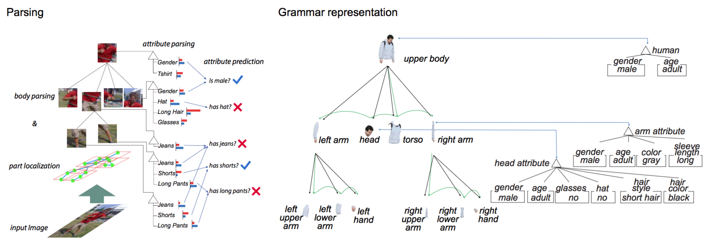
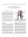
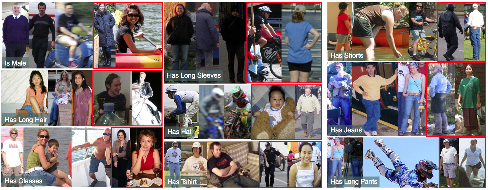



###Attributed Grammars for Joint Estimation of Human Attributes, Part and Pose

 Seyoung Park, Song-Chun Zhu 

 International Conference on Computer Vision (ICCV), 2015. 

___

####Abstract 
In this paper, we are interested in developing composi- tional models to explicit representing pose, parts and at- tributes and tackling the tasks of attribute recognition, pose estimation and part localization jointly. This is different from the recent trend of using CNN-based approaches for training and testing on these tasks separately with a large amount of data. Conventional attribute models typically use a large number of region-based attribute classifiers on parts of pre-trained pose estimator without explicitly detecting the object or its parts, or considering the correlations between attributes. In contrast, our approach jointly rep- resents both the object parts and their semantic attributes within a unified compositional hierarchy. We apply our at- tributed grammar model to the task of human parsing by simultaneously performing part localization and attribute recognition. We show our modeling helps performance im- provements on pose-estimation task and also outperforms on other existing methods on attribute prediction task.

___

--- 

#### Materials  

&nbsp;&nbsp;&nbsp;&nbsp;&nbsp;&nbsp;&nbsp;&nbsp;&nbsp;&nbsp;&nbsp;&nbsp;&nbsp;&nbsp;&nbsp;&nbsp;&nbsp;&nbsp;| pdf     | poster      | &nbsp;&nbsp; spotlight video &nbsp;&nbsp;  | code | dataset |
|:-------:|:-----------:|:----------------:|:----:|:-------:|
|&nbsp;&nbsp;&nbsp;&nbsp;   &nbsp;&nbsp;&nbsp;&nbsp;|&nbsp;&nbsp; coming soon   &nbsp;&nbsp;|&nbsp;&nbsp; coming soon     &nbsp;&nbsp;| &nbsp;&nbsp; coming soon &nbsp;&nbsp;| &nbsp;&nbsp; coming soon &nbsp;&nbsp;| 

---

#### BibTeX  

>@InProceedings{Park_ICCV15, 
>&nbsp;&nbsp; title        = {Attributed Grammars for Joint Estimation of Human Attributes, Part and Pose},  
>&nbsp;&nbsp; author       = {Seyoung Park and Song-Chun Zhu},  
>&nbsp;&nbsp; booktitle    = {International Conference on Computer Vision (ICCV)},  
>&nbsp;&nbsp; year         = {2015},  
>}

---

#### Prediction Examples  

Attribute prediction on Attributes of People Dataset. First three examples for most positive examples, and last two examples show most negative examples for each attribute. We cropped the image around the ground truth bounding box for display purpose.

---

#### Performance  

&nbsp;&nbsp;&nbsp;Method&nbsp;&nbsp;&nbsp; | &nbsp;&nbsp;Male&nbsp;&nbsp; | &nbsp;Long hair&nbsp; | &nbsp;Glasses&nbsp; | &nbsp;&nbsp;Hat&nbsp;&nbsp; | &nbsp;T-shirt&nbsp; | &nbsp;Long sleeve&nbsp; | &nbsp;&nbsp;Shorts&nbsp;&nbsp; | &nbsp;&nbsp;Jeans&nbsp;&nbsp; | &nbsp;Long pants&nbsp; | &nbsp;mAP&nbsp;
|:-:|:-:|:-:|:-:|:-:|:-:|:-:|:-:|:-:|:-:|:-:|
Poselet | 82.4 | 72.5 | 55.6 | 60.1 | 51.2 | 74.2 | 45.5 | 54.7 | 90.3 | 65.18
Joo | 88.0 | 80.1 | 56.0 | 75.4 | 53.5 | 75.2 | 47.6 | 69.3 | 91.1 | 70.7
DPD | 83.7 | 70.0 | 38.1 | 73.4 | 49.8 | 78.1 | 64.1 | 78.1 | 93.5 | 69.88
PANDA| 91.7 | 82.7 | 70.0 | 74.2 | 68.8 | 86.0 | 79.1 | 81.0 | 96.4 | 78.98
Ours | 92.1 | 85.2 | 69.4 | 76.2 | 69.1 | 84.4 | 68.2 | 82.4 | 94.9 | 80.20

